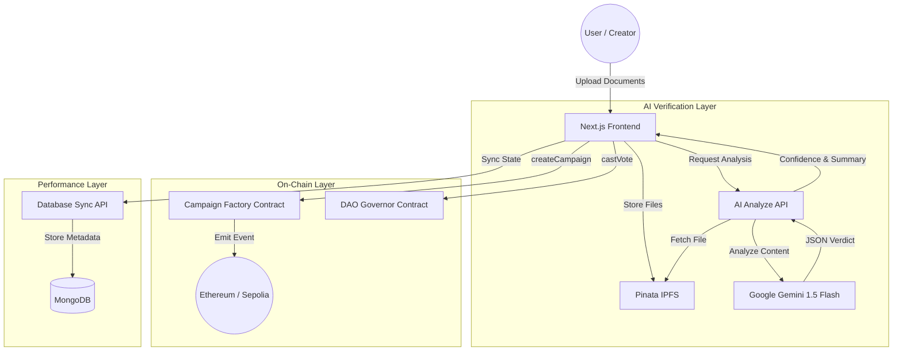

# FYDAO: Decentralized Crowdfunding with AI-Driven Governance

FYDAO is a next-generation decentralized crowdfunding platform that bridges the gap between trustless blockchain technology and real-world project verification. By integrating **Google Gemini AI** for document analysis and **On-Chain Governance** for fund release, FYDAO ensures that community capital is only released when milestones are genuinely achieved.

## 🚀 Project Overview

Traditional crowdfunding platforms suffer from a lack of accountability. FYDAO solves this by:
1.  **AI Verification**: Every campaign and milestone submission is audited by Gemini 1.5 Flash to generate a Trust Score.
2.  **Milestone Escrow**: Funds are locked in a smart contract and released only after milestone approval.
3.  **DAO Governance**: Token holders use their voting power to authorize campaigns and release capital based on AI-audited evidence.
4.  **Mira Aesthetic**: A modern, immersive UI designed for clarity and professional financial interaction.

---

## 🏗️ System Architecture

### High-Level Data Flow


### Detailed Component Interaction
1.  **Trustless Proof Submission**: Creators upload project documents through the **Mira-styled** dashboard. These are immediately pinned to **IPFS**, ensuring data permanence and content-addressed integrity.
2.  **Autonomous AI Audit**: Before a campaign is finalized on-chain, our **Gemini 1.5 Flash** integration performs a deep analysis of the proof. It checks for legitimacy, consistency with project claims, and potential fraud, returning a structured JSON payload.
3.  **On-Chain Trust Score**: The AI confidence level is passed as a parameter to the `CampaignFactory` and stored permanently in the smart contract metadata. This empowers the DAO to make informed decisions without manual review of every PDF.
4.  **Hybrid State Management**: While the blockchain remains the source of truth for funds and votes, **MongoDB** acts as a high-performance cache. It stores AI summaries and provides instant search capabilities, updated in real-time as on-chain events occur.

---

## 📂 File Structure

```text
/
├── app/                    # Next.js App Router (Pages & API)
│   ├── api/                # Backend endpoints (AI, DB Sync, Auth)
│   └── (auth)/             # Protected dashboard, campaigns, and governance routes
├── components/             # React Component Library
│   ├── ui/                 # Atomic Shadcn components (Button, Card, etc.)
│   ├── landing/            # High-conversion landing page sections
│   ├── campaign/           # Details, Creation Forms, and Milestones
│   └── governance/         # Proposal cards, Vote modals, and Stats
├── contracts/              # Blockchain configuration
│   ├── abis/               # Smart contract JSON ABIs
│   └── config.ts           # Contract addresses and network settings
├── hooks/                  # Custom React hooks for Web3 & Data fetching
├── models/                 # Mongoose Schemas (Campaign, Vote, User, etc.)
├── lib/                    # Shared libraries (MongoDB client, Utils)
├── utils/                  # Helper functions (IPFS URL helpers, etc.)
└── types/                  # TypeScript interface definitions
```

---

## 📊 Project Results

### 1. Unified "Mira" Aesthetic
We have successfully achieved visual parity between the high-fidelity landing page and the functional application.
-   **Consistency**: Applied `rounded-xl` radii and `text-sm/relaxed` typography across **30+ custom components**.
-   **Immersive Feedback**: Every interactive element (Buttons, Inputs, Selects) now uses standardized hover effects and transition scales defined in the "Mira" design language.

### 2. Verified Intelligence Integration
The transition from mock verification to a production-ready AI pipeline is complete.
-   **Contextual Auditing**: The Gemini API now receives the campaign/milestone description as a "Context" parameter, evaluating if the uploaded documents actually support the specific claim.
-   **Automated Summaries**: High-quality AI analysis summaries are stored in MongoDB and displayed in the campaign detail view to build investor trust.

### 3. Production-Grade Backend
Refactored the data layer to meet enterprise engineering standards:
-   **Mongoose Modernization**: Updated all data mutations to use `returnDocument: 'after'`, eliminating deprecation warnings and ensuring data consistency.
-   **Robust Validation**: Implemented strict sanitization for voting weights and currency inputs, preventing database errors from formatted strings (e.g., handling "1,000" vs 1000).
-   **Traceability**: Developed a dedicated `Vote` model and `/my-votes` API to provide users with a transparent history of their governance participation.

---

## 🛠️ Getting Started

1.  **Install Dependencies**: `bun install`
2.  **Environment Variables**:
    - `NEXT_PUBLIC_PINATA_GATEWAY_URL`: Your IPFS gateway.
    - `GEMINI_API_KEY`: Your Google AI Studio key.
    - `MONGODB_URI`: Your database connection string.
3.  **Run Development**: `bun dev`
4.  **Build for Production**: `bun build`
